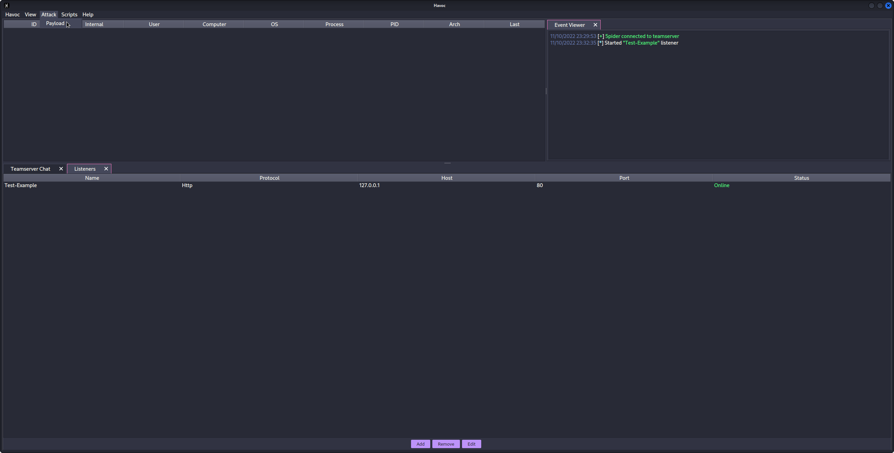
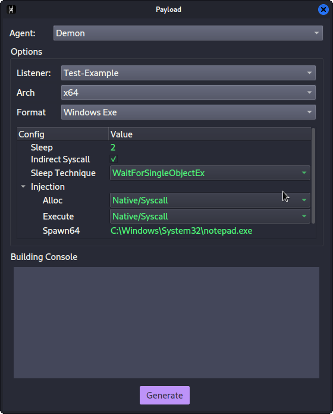
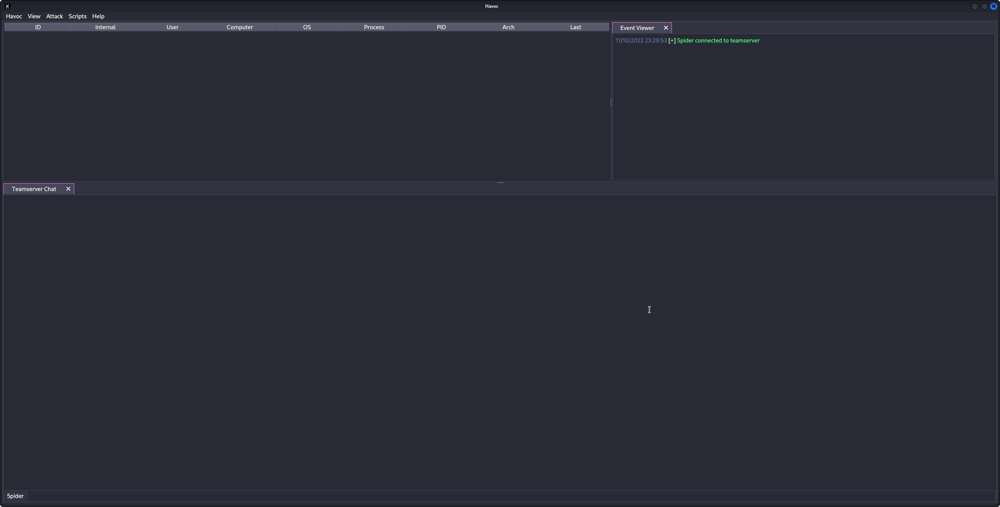

# Havoc

Havoc is a modern and malleable post-exploitation command and control framework.

#### Table of Contents
- [Version History](#vhistory)
- [Known Issues](#kissues)
- [Installation](#install)
	- [Local](#il)
	- [Docker Container](#idc)
	- [Jenkins Docker Container](#ijd)
	- [Building the Client](#bclient)
	- [Building the Teamserver](#bteam)
	- [Creating a Listener and Spawning an Agent](#aquick)
- [Teamserver](#teamserver)
	- [Starting the Teamserver](#stt)
	- [Arguments](#targ)
	- [Profiles](#profiles)
		- [Teamserver](#pteam)
		- [Operators](#pops)
	- [Demon](#pdemon)
	- [Listeners](#plisten)
- [Client](#client)
	- [Starting the client](#cstc)
	- [Connecting to the Teamserver](#cctt)
- [Agents](#agents)
	- [Demon](#ademon)
		- [Generating a Demon Payload](#adgen)
		- [Layout](#adlay)
		- [Features](#adft)
		- [Commands](#adcmds)
- [External C2](#extc2)
- [Custom Agents](#ca)
- [Python API](#pyapi)
- [Modules](#modules)
- [FAQ](#faq)
- [TODO](#todo)
--------------------

## <a name="vhistory"></a> Version History

### 0.2 / Magicians Red
> Magician's Red (Majishanzu Reddo) is the Stand of Muhammad Avdol, featured in Stardust Crusaders.
- Second public 'release' of Havoc.

`0.1 / Star Platinum`
> Named after the Stand of [Jotaro Kujo](https://jojo.fandom.com/wiki/Star_Platinum) in JoJo's Bizzare Adventure, Star Platinum was among the very first Stands introduced.

- The first, public release of Havoc.

---

## <a name="kissues"></a>Known Issues

> See the Issues tab for all open issues. 

### Kali Linux Font/Formatting Issues

Kali has issues loading the proper font (Monaco) from the embedeed Qt resources file.

_You will experience formatting issues in the Havoc client if you are not using a monospace/fixed-width font!_

### Build Errors 

#### `fatal error: Python.h: No such file or directory`

If you get an error that `Python.h` isn't found when building, you need to make sure Python 3.10 is installed and you have the Python 3.10 development files. If you are using Ubuntu LTS you may need to leverage a PPA such as `deadsnakes` to get a newer version of Python.

```
sudo apt install build-essential
sudo add-apt-repository ppa:deadsnakes/ppa
sudo apt update
sudo apt install python3.10 python3.10-dev
```

#### `incomplete type ‘QTime’ used in nested name specifier`

You probably need a newer version of Qt. If you are using Ubuntu try adding a backports ppa and installing the latest qt6 dev packages.
Please see https://github.com/HavocFramework/Havoc/issues/95.

#### `Known compiler issue: [-] Couldn't compile implant: exit status 1`

Please see https://github.com/HavocFramework/Havoc/issues/105.

---

## <a name="install"></a>Installation

### <a name="il"></a> Local

#### Pre-requisites
> The immediate following is for Debian based Distros only.
```
sudo apt install -y git build-essential apt-utils cmake libfontconfig1 libglu1-mesa-dev libgtest-dev libspdlog-dev libboost-all-dev libncurses5-dev libgdbm-dev libssl-dev libreadline-dev libffi-dev libsqlite3-dev libbz2-dev mesa-common-dev qtbase5-dev qtchooser qt5-qmake qtbase5-dev-tools libqt5websockets5 libqt5websockets5-dev qtdeclarative5-dev golang-go qtbase5-dev libqt5websockets5-dev libspdlog-dev python3-dev libboost-all-dev mingw-w64 nasm
```


#### Ubuntu 20.04 / 22.04

> You must enable Python 3.10 in your APT repositories before you can run the Client successfully.

```
sudo apt install build-essential
sudo add-apt-repository ppa:deadsnakes/ppa
sudo apt update
sudo apt install python3.10 python3.10-dev
```

#### Debian 10/11

> You must setup the `bookworm` repo for Python 3.10.

```
echo 'deb http://ftp.de.debian.org/debian bookworm main' >> /etc/apt/sources.list
sudo apt update
sudo apt install python3-dev python3.10-dev libpython3.10 libpython3.10-dev python3.10
```
#### MacOS

> You must have [`homebrew`](https://brew.sh) installed.
```
brew install --cask cmake
brew install python@3.10 qt@5 spdlog golang
brew link --overwrite qt@5
```

### <a name="bclient"></a>Building the Client

> If you are using a debian-based distro, you can use the bundled installation script at `/Havoc/Client/Install.sh`. 


Clone the repository:
```
git clone https://github.com/HavocFramework/Havoc.git
```

Build and Run:
```
cd Havoc/Client
make 
./Havoc 
```

> On macOS, run `brew unlink qt && brew link qt` after cmake build is done.

### <a name="bteam"></a>Building the Teamserver

Install additional Go dependencies:
```
cd Havoc/Teamserver

go mod download golang.org/x/sys  
go mod download github.com/ugorji/go
```

Build and Run:
```
cd Teamserver

# Install MUSL C Compiler
./Install.sh

# Build Binary
make
./teamserver -h

# Run the teamserver
sudo ./teamserver server --profile ./profiles/havoc.yaotl -v --debug
``` 

All files created during interaction with the Teamserver are stored within the `/Havoc/Teamserver/data/*` folder.


### <a name="idc"></a> Docker

Build the Dockerfile with Jenkins:
`sudo docker build -t havoc-client -f Client-Dockerfile .`

Create data volume for persistence (optional):
`sudo docker volume create havoc-c2-client`

Run the container:
`sudo docker run -p 443:443 -p 40056:40056-it -d -v havoc-c2-client:/data havoc-client`

Enter the container and run the Client:
- NOT COMPLETE

### <a name="ijd"></a> Jenkins Docker Build

Build the Dockerfile with Jenkins:
`sudo docker build -f JC-Dockerfile .`

Run the container:
`sudo docker run -p8080:8080 -it -d -v havoc-c2-data:/data havoc-client`

Visit Jenkins at `localhost:8080` and create a pipeline to build the Havoc Teamserver.
- See `Havoc-Teamserver.groovy` in the `assets` folder.


### <a name="aquick"></a> Creating a Listener, and Spawning an Agent
This part assumes you have a Teamserver running, with a Teamserver-client connected to the running instance.
- Creating a Listener:
	1. To create a new listener, we must first open the `Listeners` subwindow.
		* To do this, in the upper left hand corner, click on the `View` button, and then on the `Listeners` button in the drop down menu.
		* 	
	2. You should see a new sub window in the bottom of the server window, with the title of `Listeners` on the header tab.
	3. You should also now see three(3) buttons on the bottom of the server window, `Add`, `Remove` and `Edit`.
		* 
	4. We want to click the `Add` button.
	5. Once we click the `Add` button, you should see a new window come up, with the title of `Create Listener`.
		* 
	6. We will want to fill out the appropriate information for each field in the `Create Listener` window.
	7. After entering the appropriate information into each field, then click the `Save` button.
	8. The window will close, and you will now see a new line in the `Listeners` sub-window.
		* 
	9. We now have an active Listener, and are ready to receive an incoming agent's communications!
- Spawning an Agent:
	1. To create an Agent Payload, we must first open the `Payload` window.
		* We can do so by going up to the upper left hand corner, and clicking on the `Attack` button. 
	2. Doing so, we see the `Payload` button appear in the drop down menu. We want to then click on it.
		* 
	3. This will open the `Payload` window, where we may then configure the various options for generating our payload.
		* 
	4. Once we have selected the appropriate options, we then click on the `Generate` button.
	5. It might take a little bit for the compilation to take place. Once it has completed, it will prompt you as to where to save the resulting file output.
	6. After selecting where to save the file, you will now have a generated agent ready for execution or injection!


---

## <a name="teamserver"></a>Teamserver

The Havoc Teamserver is written in Golang. It handles the listeners, teamserver authentication and payload generation. It also supports ExternalC2 functionality through the configuration of Service endpoints.

### <a name="stt"></a> Starting the Teamserver

Running `./teamserver server --profile ./profiles/havoc.yaotl -v --debug` will launch the built Teamserver with verbosity and debugging enabled.

Data collected by the Teamserver is stored in the `/Havoc/Teamserver/data/*` directory.

### <a name="targ"></a>Arguments

Usage: `teamserver [command] [flags]`

Here is a full list of arguments that can be passed to the teamserver:

| Command  | Flag | Description | Args |
| -------- | ---- | ----------- | ----- |
| `server` |`--profile` | The configuration profile to load at start | Teamserver profile path (`string`) |
|  | `-v` / `--verbose` | Enable verbose output | |
|  | `-d` / `--debug` | Enable debug ouput | |
|  | `-h` / `--help` | Output server help | |
|  | `--debug-dev` | Enables DEBUG output (see below for caveats) | |

#### Enabling DEBUG Output

> DEBUG output can be enabled by passing the `--debug-dev` flag to the Teamserver.

When this flag is set, the Teamserver's `builder` class adds the `-D DEBUG` flag to the `builder.compilerOptions.CFlags` array and removes the `-nostdlib` flag to enable output to be printed to the console. Demon agent payloads genereated from the Havoc client will print visible DEBUG text in the console window after execution. The stdlib will be linked into the payload for this to occur, increasing the payload size.

### <a name="tprofiles"></a>Profiles

Havoc's Teamserver uses profiles in the `yaotl` format, which is a custom configuration syntax built on top of [HCL](https://github.com/hashicorp/hcl).

Profiles are located at: `Havoc/Teamserver/profiles` and can be passed to the `teamserver` with the `--profile <path-to-profile` flag.

The default example profile can be found at `Havoc/Teamserver/profiles/havoc_default.yaotl`.


#### <a name="pteam"></a>Teamserver
The teamserver can be configured to listen on a specific bind address and port with the following directive:

```hcl
Teamserver { 
    Host = "0.0.0.0"
    Port = 40056
}
```

- `Host` - The bind address used by the teamserver to accept Client connections.
- `Port` - The port the teamserver listens on for Client connections.

#### <a name="pops"></a>Operators

Multiple users can be added to the Teamserver with the Operators directive:

```hcl
Operators {
	user "5pider" {
		Password = "password1234"
	}

	user "Neo" {
		Password = "password1234"
	}
}
```

#### <a name="pdemon"></a>Demon

The primary Demon agent accepts a number of configuration options such as:

```hcl
Demon {
    Sleep   = 2
    Jitter  = 20

    Implant {
        SleepMask = 1
        SleepMaskTechnique = 0
    }

    Injection {
        Spawn64 = "C:\\Windows\\System32\\notepad.exe"
        Spawn32 = "C:\\Windows\\SysWOW64\\notepad.exe"
    }
}
```

- `Sleep` - The default interval to sleep between check-ins for commands.
- `Jitter` - The amount of jitter to be applied to sleep intervals (in milliseconds).

- `Implant\SleepMask` - Enables the Sleep Mask obfuscation
- `Implant\SleepMaskTechnique` - Chose from a variety of built-in sleep mask techniques:
    - `0` - [WaitForSingleObjectEx](https://docs.microsoft.com/en-us/windows/win32/api/synchapi/nf-synchapi-waitforsingleobjectex) (no obfuscation)
    - `1` - [FOLIAGE](https://github.com/SecIdiot/FOLIAGE)
    - `2` - [Ekko](https://github.com/Cracked5pider/Ekko)

- `Injection\Spawn64` - The full path to the process to spawn into for fork & run operations (64bit).
- `Injection\Spawn32` - The full path to the process to spawn into for fork & run operations (32bit).

#### <a name="plisten"></a>Listeners

> Currently, only HTTP/HTTPS listeners are supported.

Havoc supports multiple listener profiles and a variety of configuration options to help customize them.

```hcl
Listeners {
    Http {
        Name        = "HTTPS Listener"
        Host        = "10.0.0.10"
        Port        = 443
        Method      = "POST"
        Secure      = true
        UserAgent   = "Mozilla/5.0 (Windows NT 6.1; WOW64) AppleWebKit/537.36 (KHTML, like Gecko) Chrome/96.0.4664.110 Safari/537.36"
        Uris        = [
            "/funny_cat.gif",
            "/index.php",
            "/test.txt",
            "/helloworld.js"
        ]
        Headers     = [
            "X-Havoc: true",
            "X-Havoc-Agent: Demon",
        ]

        Response {
            Headers = [
                "Content-type: text/plain",
                "X-IsHavocFramework: true",
            ]
        }

    }
}
```

---

## <a name="client"></a>Client

The Havoc Client is written in C++ and Qt.

### <a name="cstc"></a>Starting the Client

```
cd Havoc/Client
./Havoc
```
Running `./Havoc` will start the Client.


### <a name="cctt"></a>Connecting to the Teamserver

When the client opens, you will be presented with a profile window similar to that in other C2 frameworks like Cobalt Strike. 


Enter the profile name, teamserver bind address (`Host`) and `Port`, along with your defined username/password in the teamserver profile. 
Then hit 'Connect' to connect your configured teamserver.




---

## <a name="agents"></a>Agents

### <a name="ademon"></a>Demon

Demon is the primary Havoc agent, written in C/ASM. The source-code is located at `Havoc/Teamserver/data/implants/Demon`.

#### <a name="adgen"></a>Generating a Demon Payload

> Currently, only x64 EXE/DLL formats are supported.

From the Havoc UI, nagivate to `Attack -> Payload`. 

#### <a name="adlay"></a>Layout

| Directory       | Description                                           |
| --------------- | ----------------------------------------------------- |
| `Source/Asm`    | Assembly code (return address stack spoofing)         |
| `Source/Core`   | Core functionality (transport, win32 apis, syscalls)  |
| `Source/Crypt`  | AES encryption functionality                          |
| `Source/Extra`  | KaynLdr (reflective loader)                           |
| `Source/Inject` | Injection functionality                               |
| `Source/Loader` | COFF Loader, Beacon API                               |
| `Source/Main`   | PE/DLL/RDLL Entry Points                              |

#### <a name="adft"></a> Features

##### Indirect Syscalls

When compiled with `OBF_SYSCALL`, Demon performs indirect syscalls for many Nt* APIs. By masquerading the `RIP` to point to a location within `ntdll.dll`, traps placed by EDR solutions (such as process instrumentation callbacks or other forms of sycall tracing)may be evaded. 

The Syscall logic is primarily contained within `/Teamserver/data/implants/Demon/Source/Core/Syscalls.c`

Syscall stubs are dynamically crafted from ntdll.dll on disk and modified so the return address points to `NtAddBootEntry (0x180024b6)` within the ntdll.dll module.

#### <a name="adcmds"></a>Commands

Demon has a variety of commands built-in. It also supports the dynamic modification of configuration at runtime, allowing operators to customize defaults pre-set in the profiles throughout an engagement, without modifying the profile and re-generating a payload.

Full documentation on commands can be accessed from the Havoc client by typing `help` in the interact window. For more information on a particular command, simply tack it on the end of help like so: `help [command]`

##### `checkin`

Requests a checkin request from the Demon. This will output some basic system/configuration information to the Havoc client such as:

- Demon Metadata
    - Magic values
    - First/Last call in timestamps
    - AES Key and IV
    - Sleep Delay
- Host Information
    - Hostname
    - Username
    - Domain Name
    - Internal IP(s)
- Process Information
    - Name
    - Architecture
    - PID
    - Path
    - Elevated
- Operating System
    - Version
    - Build
    - Architecture

##### `sleep`

Demon supports sleeping at a specified delay (seconds) with a randomized jitter amount applied in the profile configuration settings.

`sleep [delay]`

When the Demon sleeps, it first checks if Sleep Masking is enabled in the profile configuration. If so, as long as there are no active job threads running, it will begin to apply the specified sleep obfuscation method and wait until the provided delay to "wake up" and check-in to the teamserver again.

During sleep, x64 demons may implement [return address spoofing](https://www.unknowncheats.me/forum/anti-cheat-bypass/268039-x64-return-address-spoofing-source-explanation.html) to hide the real return address.

##### `job`

Demon implements a multi-threaded job management system that allows the operator to manage long-running tasks. 

> OPSEC NOTE: Long-running jobs will PREVENT sleep obfuscation from occuring at the specified sleep interval due to the other threads running. Sleep obfuscation will only occur when there are no job threads in a running state.

- `job list` - Lists all running jobs.
- `job suspend 1` - Suspends a job with the ID of 1
- `job resume 1` - Resumes a job with the ID of 1
- `job kill 1` - Kills a job with the ID of 1

##### `proc`

Process management and enumeration system.

`proc [command]`

- `proc list` - Display a list of running processes on the target.
- `proc kill [pid]` - Kills a process with the specified PID
- `proc create [state] [process] (args)` Start a process either in suspended or normal mode.
- `proc module [pid]` lists loaded modules from the specified process. 
- `proc grep [process name]` searches for specified running process and shows Process Name, Process ID, Process Parent PID, Process User, Process Arch
- `proc memory [pid] [memory protection]` queries process memory pages with specified Protection. 


##### `token`

Demon implements a token management vault that allows for token theft, impersonation and privilege modification. All tokens are preserved within a token vault, allowing the operator to list and impersonate any stolen token when convenient.

> Tokens are duplicated using `SecurityIdentification` and `SecurityImpersonate` privileges, allowing `OpenThreadToken` to work on impersonated UIDs with OpenAsSelf set to TRUE.

- `token getuid` - Prints the current user id from the token
- `token list` - List all stolen tokens in the token vault
- `token steal [pid]` - Steal the token from the specified PID and save it to the token vault
- `token impersonate [id]` - Impersonate a token from the token vault
- `token make [domain] [username] [password]` - Creates a token from the specified credentials and adds it to the vault
- `token privs-get` - Attempt to acquire all privileges from the current token
- `token privs-list` - List all privileges from the current token
- `token revert` - Reverts back to the default process token
- `token remove [id]` - Removes a token from the vault
- `token clear` - Removes all tokens from the vault.

##### `shellcode`

Demon is capable of injecting shellcode (supplied in raw format as a path) into remote processes using process injection or fork & run. Depending on the technique, operators can chose to use higher-level Win32 APIs or NT versions using indirect syscalls.

- `shellcode inject x64 [pid] [path-to-raw-shellcode]` - Injects shellcode into the remote process
- `shellcode spawn x64 [path-to-raw-shellcode]` - Launches the defined fork & run process and injects the shellcode

> OPSEC NOTE: Depending on your injection technique and configuration settings, certain API calls may be performed outside of indirect syscalls. 

Here is a high-level overview of each supported process injection technique:

> `*` means the API call is performed with indirect syscalls

**`INJECTION_TECHNIQUE_SYSCALL`**
1. `CreateProcessA`
2. Allocate Memory
    - `DX_MEM_WIN32 -> VirtualAllocEx`
    - `DX_MEM_SYSCALL -> NtAllocateVirtualMemory*`
3. `NtWriteVirtualMemory*`
4. `NtProtectVirtualMemory*`
5. Create Thread 
    - `DX_THREAD_WIN32 -> CreateRemoteThread`
    - `DX_THREAD_SYSCALL -> NtCreateThreadEx*`
6. `NtResumeThread*`

##### `dotnet`

- `dotnet list-versions` - Lists all of the installed dotnet versions
- `dotnet inline-execute [path-to-assembly] [args]` - Executes the dotnet assembly inside of the current process and returns output

> OPSEC NOTE: Calling `inline-execute` creates an instance of the CLR (Common Language Runtime) within the demon's process to execute dotnet assemblies. This is an irreversible procedure and may provide more IoCs to defenders.

The `inline-execute` works by first creating an instance of the CLR (Common Language Runtime) within the current Demon process. After the CLR is created, `amsi.dll` is loaded and patched in-memory to bypass AMSI scanning. Demon then creates an AppDomain and loads the assembly into memory, finding the entry point and passing the commandline args supplied by the user before invoking the method. Output from the assembly is captured and returned to the teamserver.


(INCOMPLETE)

---

## <a name="extc2"></a>ExternalC2

Havoc supports custom agents and ExternalC2 by using Teamserver service endpoints. These are configured using `Service` directives (see the Teamserver Profiles documentation).

The Service module is for interacting with external services (custom agents, ExternalC2, etc). 

By registering a Service directive, the Teamserver will automatically spawn a service listener that can route commands to/from the Teamserver.

```hcl
Service {
    Endpoint = "service-endpoint"
    Password = "service-password"
}
```

This would create a service endpoint at `<teamserver-host>:<teamserver-port>/service-endpoint` that is authenticated with `service-password`. 


## <a name="ca"></a>Custom Agents

Using Havoc's Service API, custom, third-party agents can be written to interact with the teamserver using the intermediate Python API.

An example of a third-party agent is provided here: [https://github.com/HavocFramework/Talon](https://github.com/HavocFramework/Talon)

`Talon.py` connects to the Teamserver over the `Endpoint` defined in the `Service` directive of the teamserver profile.

```python
from havoc.service import HavocService
from havoc.agent import *

class MyCustomAgent(AgentType):
    # ...
    pass

agent = MyCustomAgent()

havoc_service = HavocService(
    endpoint="ws://0.0.0.0:40056/service-endpoint",
    password="service-password"
)

havoc_service.register_agent(agent)
```

Custom commands can be defined using the Python API and extending the Command class:

```python
class CommandShell(Command):
    CommandId = COMMAND_SHELL
    Name = "shell"
    Description = "executes commands using cmd.exe"
    Help = ""
    NeedAdmin = False
    Params = [
        CommandParam(
            name="commands",
            is_file_path=False,
            is_optional=False
        )
    ]
    Mitr = []

    def job_generate( self, arguments: dict ) -> bytes:        
        Task = Packer()

        Task.add_int( self.CommandId )
        Task.add_data( "c:\windows\system32\cmd.exe /c " + arguments[ 'commands' ] )

        return Task.buffer
```

---

## <a name="pyapi"></a>Python API


[https://github.com/HavocFramework/havoc-py](https://github.com/HavocFramework/havoc-py)

---

## <a name="modules"></a>Modules

Aside from Havoc's built-in commands, Modules can be loaded into the framework to add more functionality.

An example of some of Havoc's official modules can be found at this repository:

[https://github.com/HavocFramework/Modules](https://github.com/HavocFramework/Modules)


Module Template: [https://github.com/HavocFramework/Modules/tree/main/Template](https://github.com/HavocFramework/Modules/tree/main/Template)


Official Modules:
- Powerpick
    - Executes unmanaged PowerShell commands by loading the CLR runtime (`4.0.30319`) into the designated fork & run process.
- InvokeAssembly
    - Executes a dotnet assembly into a separate process by bootsrapping the CLR into the designated fork & run process and passing the arguments.
    - The dotnet version can be specified in the arguments (`v4.0.30319` is default), as well as the AppDomain name (`DefaultAppDomain` is default).


---

## <a name="faq"></a>FAQ

### Why does Havoc not perform sleep obfuscation when jobs are running?
Jobs are ran in their own threads, and sleep obfuscation requires that all threads are suspended in order to encrypt the heap, otherwise the process would crash. 

---
